# Practica 3.1 Tomcat y Maven. 
## Instalación de Apache Tomcat en Debian 11. 
### Configuración Previa .
Antes de empezar tenemos que abrir el puerto por defecto de tomcat 8080 con el siguiente comando:
```console
sudo ufw allow 8080
```
A continueación actualizaremos los repositorios ejecutando el siguiente comando. 

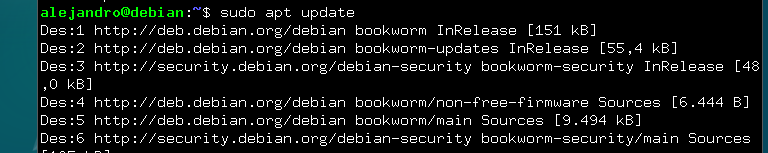

Instalaremos Java como se muestra en la siguiente captura. 

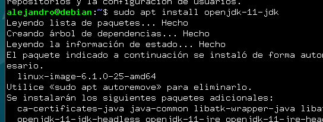

### Instalación. 
Instalamos tomcat con el siguiente comando: 

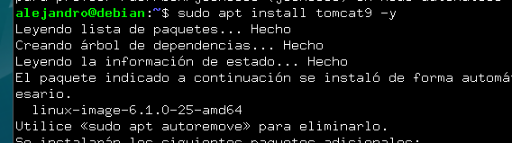

Ahora añadiremos un usuario de tomcat, previamente habiendo creado un grupo ejecutando los comandos de la captura.

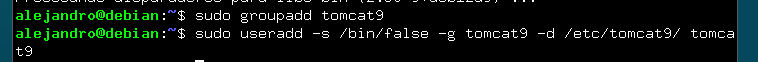

Ahora que Tomcat está instalado, podemos iniciarlo y comprobaremos si lo hace de forma correcta, debería aparecer como en la captura. 

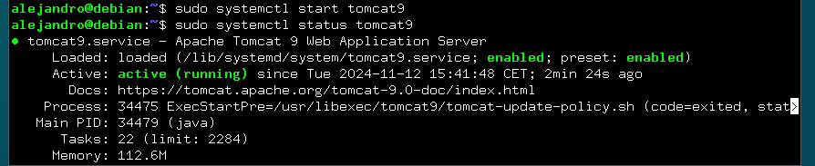

Ahora definiremos un usuario con acceso a tomcat. Para ello entraremos en el archivo de configuración **/etc/tomcat9** 

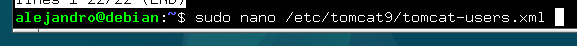

Y lo editaremos de la siguiente manera. 

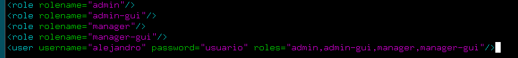

Ahora si accedemos al enlace http://localhost:8080 debería salir lo siguiente. 

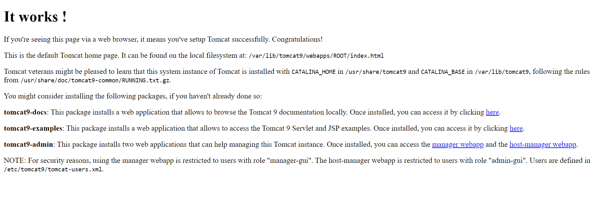

El siguiente paso es descargar el gestor web de Tomcat y el administrador anfitrión de Tomcat de la siguiente manera: 

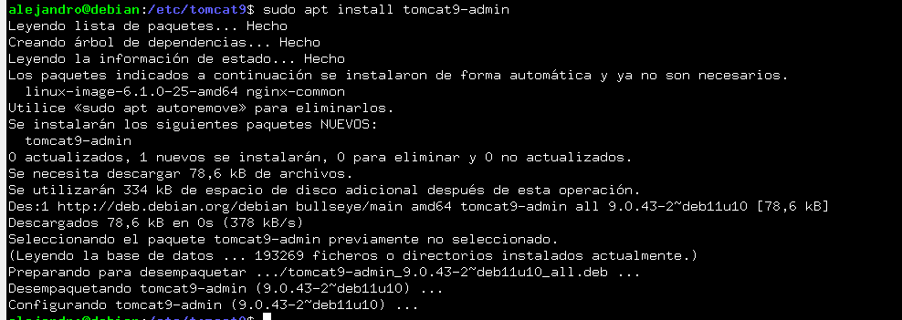

Tras esto podemos acceder a localhost con nuestras credenciales de usuario previamente introducidas y accederemos a la siguiente página. 

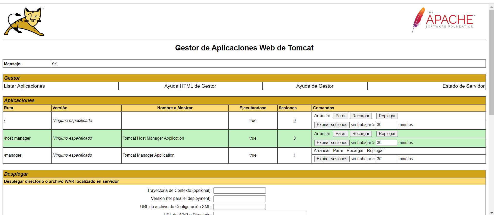


## Despliegue Manual Mediante GUI de administración
En la siguiente sección de la página previamente abierta, subiremos un archivo war que en este caso se llamará sample y le damos a desplegar.

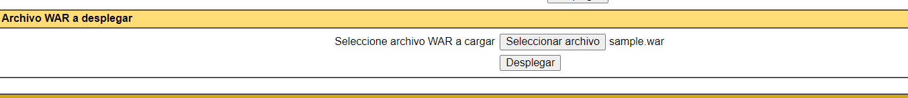

Tras el despliegue nos apracerá en aplicaciones .

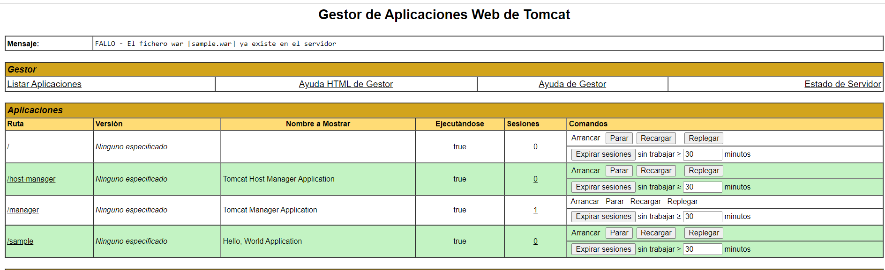

Si hacemos click podremos acceder a el archivo que se verá de la siguiente manera. 

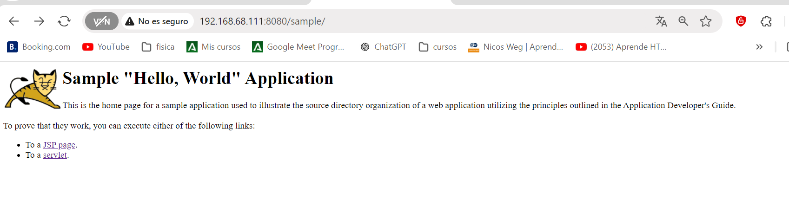

## Instalación de Maven. 
Instalamos maven con el siguiente comando :

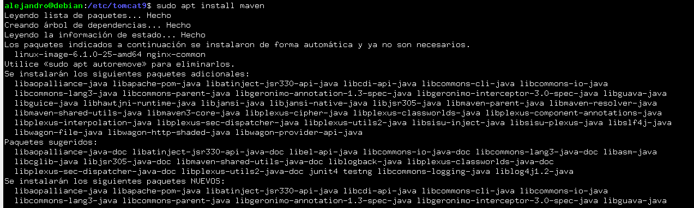

Tras esto comprobamos si maven está instalado y la versión que tenemos:

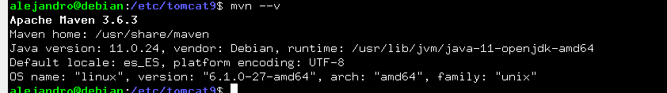

## Despliegue Aplicacion Prueba

Debemos añadir configuraciones al archivo de **/etc/tomcat9/tomcat-user.xml** para que permita que Maven se autentique contra Tomcat y pueda realizar el despliegue. 

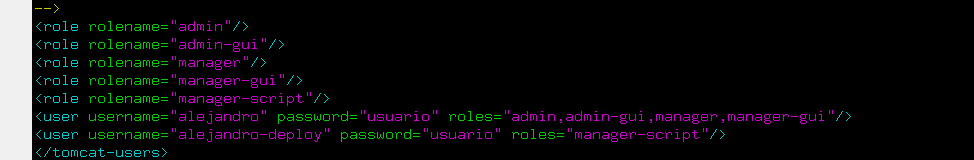

Como segundo paso deberemos editar el archivo **/etc/maven/settings.xml** para indicarle a Maven un identificador para el servidor sobre el que vamos a desplegar, así como las credenciales, como aparece en la siguiente captura: 

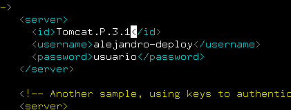

Teniendo ya listo para realizar despligues, ahora crearemos una aplicacion de JAva para ver si podemos desplegarla sobre la arquitectura que ya hemos montado para ello usaremos el siguiente comando : 
```console
mvn archetype:generate -DgroupId=raul -DartifactId=war-deploy -DarchetypeArtifactId=maven-archetype-webapp -DinteractiveMode=false
```

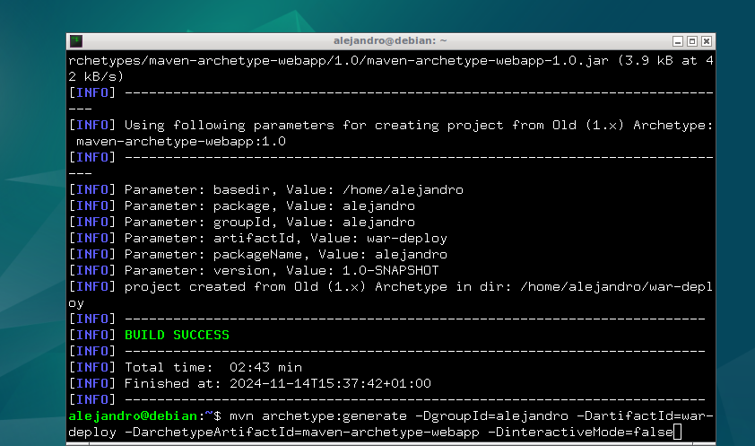

Tras esto, se abrá creado en la raíz una carpeta que es la que contiene la aplicación con los siguientes archivos :

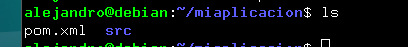

Ahora editaremos el pom.xml de la siguiente manera.

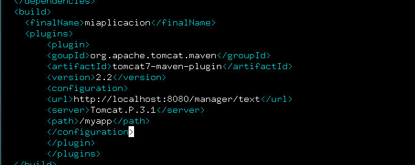

Tras esto veremos nuestra aplicación subida a la web y podremos acceder a ella. 

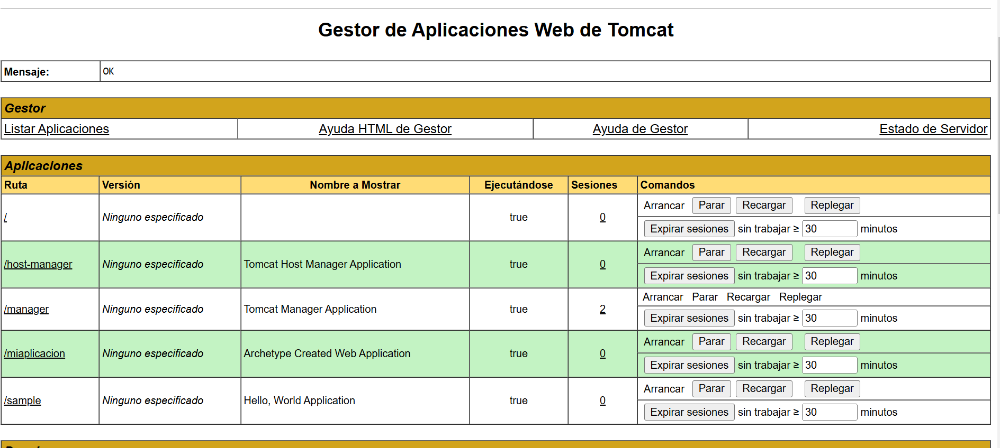

## Rock Paper Scissorc
Realizaremos el despliegue con otra aplicación alojada en un repositorio de github. 
Primero lo clonamos : 

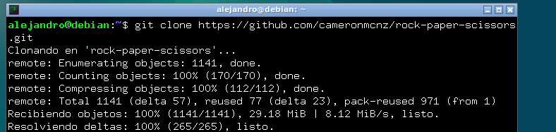

Tras esto nos situaremos dentro de la carpeta del repositorio clonada y cambiamos de rama con el siguiente comando.

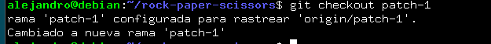

Subiremos el archivo .war que se enceuntra dentro de la carpeta target del respositorio desde el manager de tomcat. 

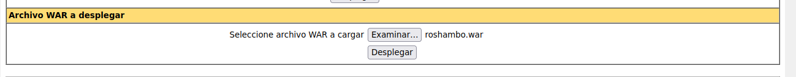

Configuraremos el pom.xml con lo siguientes datos:

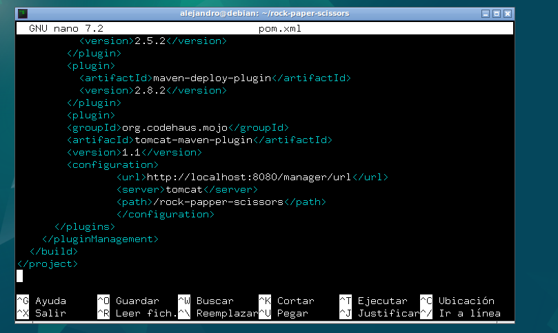

Desplegamremos la aplicación  con el siiguiente comando en el mismo nivel en el que se encuentra el archivo pom.xml. 
```
mvn tomcat:deploy
```


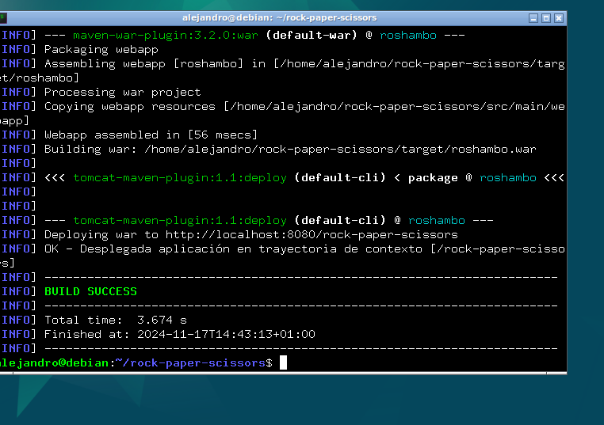

Vemos que la aplicacion está en el manager de tomcat.

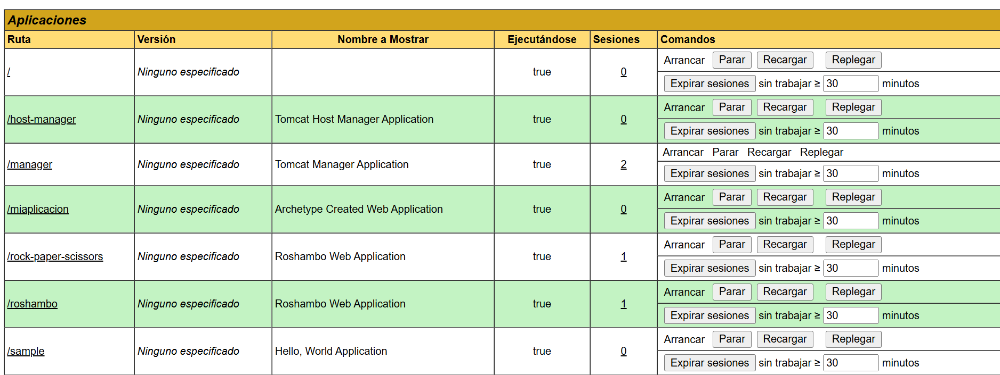

Mediante la ruta http://localhost:8080/rock-paper-scissors accederemos a la aplicación y podremos interactuar con ella. 


## Cuestiones : 
Habéis visto que los archivos de configuración que hemos tocado contienen contraseñas en texto plano, por lo que cualquiera con acceso a ellos obtendría las credenciales de nuestras herramientas.

En principio esto representa un gran riesgo de seguridad, ¿sabrías razonar o averigüar por qué esto está diseñado de esta forma?

Las contraseñas en texto plano presentan una simplicidad y compatibilidad, estas se usan para facilitar  una configuración rápida y la integración de herramientas sin complicaciones. Esta seguridad se basa en restringir el acceso al sistema en lugar de cifrar las contraseñas, por lo que supone un riesgo si alguien se hace con los archivos. 
